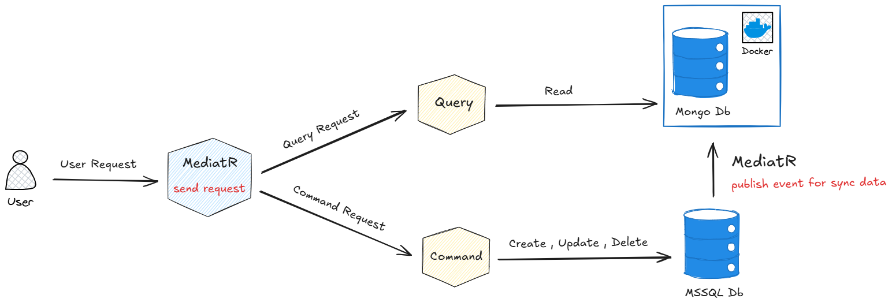
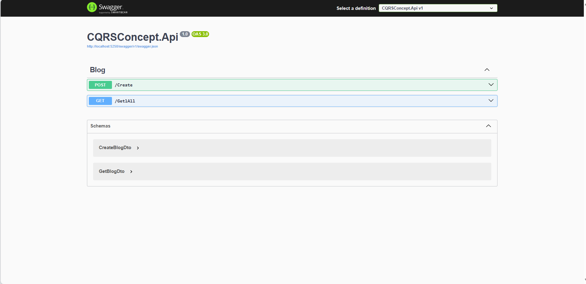

# CQRSConcept

A clean and pragmatic .NET 9 solution demonstrating the **CQRS (Command Query Responsibility Segregation)** pattern using **MediatR**, **MongoDB**, **SQL Server**, and a **Component-Based Architecture**.

---




## 🧩 Architecture Overview

This project follows a multi-layered, component-based architecture with full separation of concerns using CQRS principles:

- **Command Side**:
  - Uses SQL Server for handling write operations.
  - MediatR dispatches commands to appropriate handlers.
  - Triggers events to keep the read models in sync.

- **Query Side**:
  - Uses MongoDB for efficient, scalable read operations.
  - Queries are handled via MediatR and mapped to read models.

- **Component Layers**:
  - `CQRSConcept.Api` – The API layer exposing HTTP endpoints, features, consumers.
  - `CQRSConcept.Domain` – Core domain and services (domain logic), contracts.
  - `CQRSConcept.Infrastructure` – Data persistence, repositories, external services.

---




## 🗂️ Solution Structure

```text
CQRSConcept/
│
├── src/
│   ├── CQRSConcept.Api               # ASP.NET Core Web API (.NET 9)
│   ├── CQRSConcept.Domain            # Domain logic & contracts
│   └── CQRSConcept.Infrastructure    # Data access, MongoDB & SQL integration
│
└── docker-compose/                   # Docker setup (MongoDB, etc.)

